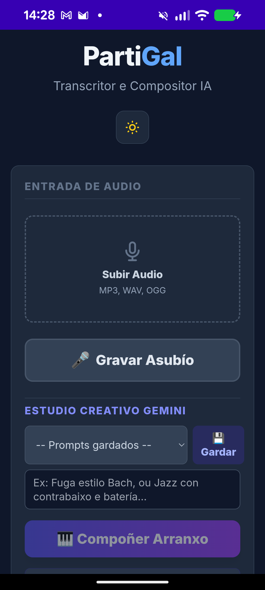

# PartiGal

**O teu compañeiro de composición musical impulsado por IA.**

PartiGal é unha aplicación híbrida para Android que transforma os teus asubíos en partituras musicais completas. Utilizando a potencia de Google Gemini 3.0, a app non só transcribe a túa melodía, senón que a harmoniza, arranxa e incluso escribe a letra, todo directamente no teu dispositivo.

## ✨ Funcionalidades Principais

* **🎙️ De Asubío a Partitura:** Grava o teu asubío (ou carga un arquivo de audio) e o noso motor de detección de ton converterao instantaneamente en notas musicais.
* **🧠 Compositor IA (Gemini):**
  * **Arranxos Completos:** Transforma unha simple melodía nunha obra para cuarteto de corda, banda de jazz, ou estilo barroco.
  * **Letrista Automático:** Xera letras que encaixan na métrica da túa melodía, en galego.
  * **Profesor Virtual:** Recibe críticas construtivas e suxerencias de mellora musical.
* **🎼 Editor de Partituras:** Visualización profesional con VexFlow.
* **💾 Modo Offline SATB:** Harmonización algoritmica clásica a catro voces (Soprano, Contralto, Tenor, Baixo) dispoñible sen conexión a internet.
* **🎹 Reprodución Avanzada:** Motor de audio baseado en Tone.js con instrumentos sintetizados de alta calidade.
* **⬇️ Exportación MIDI:** Leva a túa creación ao teu DAW favorito.

## 🚀 Tecnoloxía

* **Frontend:** HTML5, TailwindCSS, Vanilla JS.
* **Audio:** Tone.js (Síntese), Web Audio API (Análise e Efectos).
* **IA:** Google Gemini API (Modelos Flash e Pro).
* **Notación:** VexFlow.
* **Nativo:** Android WebView wrapper sen ActionBar.

---

## English Summary

**PartiGal** is an AI-powered music composition assistant for Android that turns your whistled melodies into fully arranged musical scores.

**Key Features:**

* **Whistle-to-Score:** Real-time pitch detection converts audio input into MIDI notes.
* **AI Power (Gemini 3.0):** Generates full instrumental arrangements, lyrics in Galician, and provides music theory critiques.
* **Offline Mode:** Includes a local algorithmic SATB (4-part harmony) generator for use without internet.
* **Pro Audio:** High-quality playback using Tone.js and MIDI export capabilities.
* **Privacy First:** Audio processing happens locally or securely via API; no data is stored on external servers permanently.
